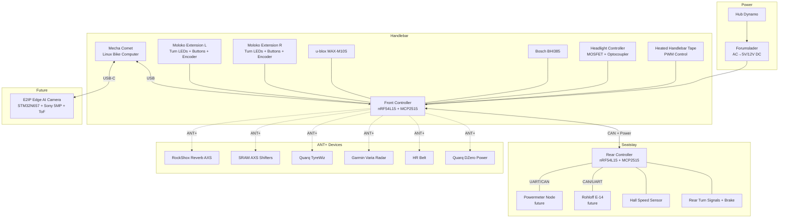
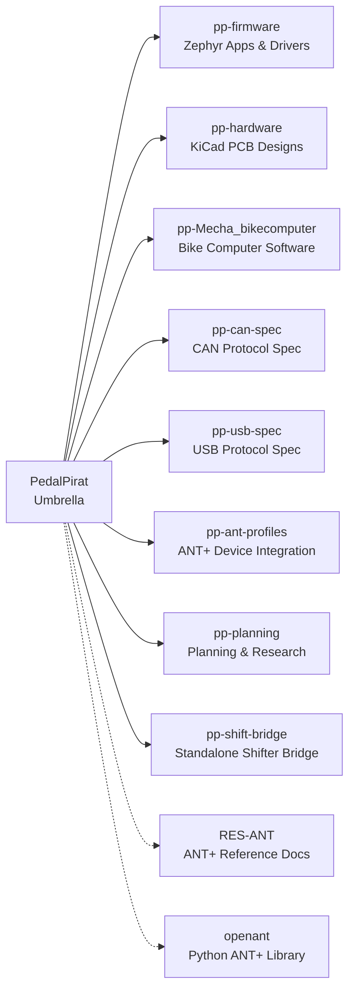
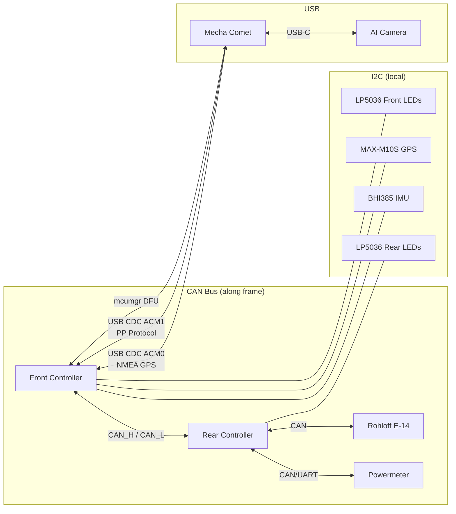
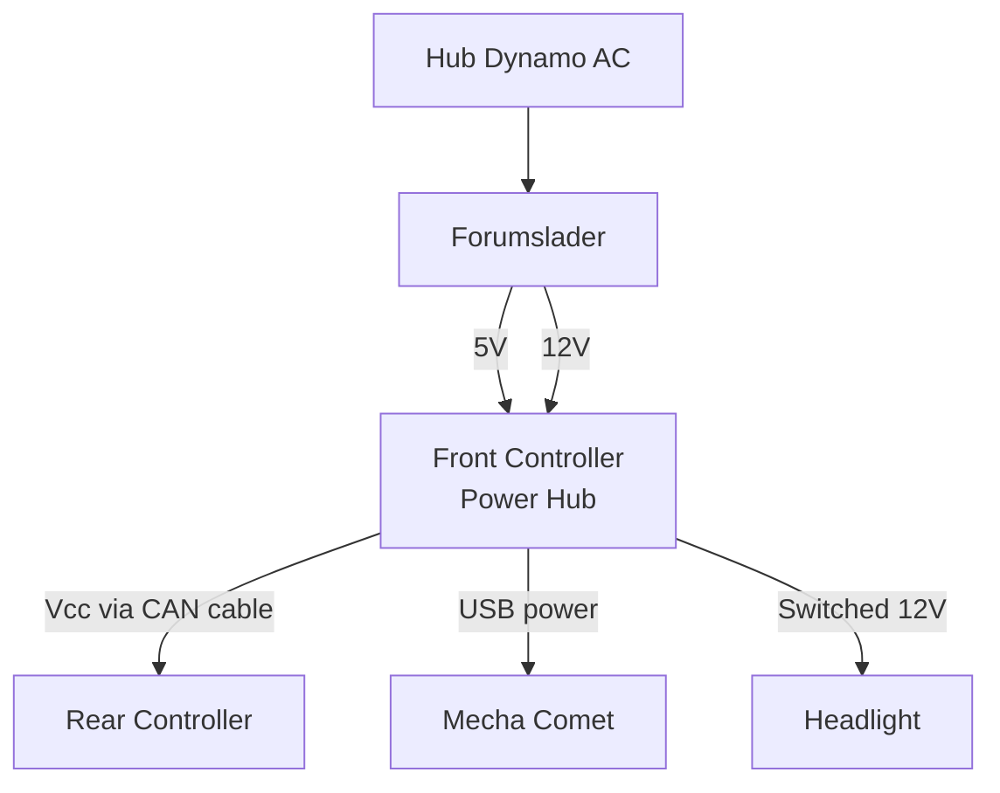

# PedalPirat

Open Source Smart Bike Platform — ANT+, CAN, Zephyr RTOS, AI Cameras, and more.

## Vision

Build the ultimate smart bike by replacing proprietary ecosystems with an open, modular platform that:

- Replaces proprietary batteries with a central Forumslader dynamo-powered system
- Mixes vendors freely (Shimano levers with SRAM AXS? Yes.)
- Adds safety features: turn signals, brake lights, radar, AI cameras
- Automates shifting (Rohloff E-14, Di2, SRAM AXS)
- Fuses sensor data and logs everything
- Heated handlebar tape, because why not

## System Architecture

## Repositories

| Repository | Description |
|---|---|
| [`pp-firmware`](../pp-firmware/) | Zephyr RTOS firmware — apps, drivers, CAN library, light patterns, autoshift gateway |
| [`pp-hardware`](../pp-hardware/) | KiCad PCB designs — front controller, rear controller, moloko extensions |
| [`pp-Mecha_bikecomputer`](../pp-Mecha_bikecomputer/) | Mecha Comet bike computer (pizero_bikecomputer fork + USB integration) |
| [`pp-can-spec`](../pp-can-spec/) | CAN bus protocol specification — message IDs, DBC, docs |
| [`pp-usb-spec`](../pp-usb-spec/) | USB CDC protocol — Front Controller ↔ Mecha Comet (composite: NMEA + binary) |
| [`pp-ant-profiles`](../pp-ant-profiles/) | ANT+ device profiles — standard & reverse-engineered (SRAM, Reverb, Varia) |
| [`pp-planning`](../pp-planning/) | Planning, research notes, outreach drafts, session logs |
| [`pp-shift-bridge`](../pp-shift-bridge/) | Standalone ANT+ shifter → Rohloff E-14 / Pinion Smart.Shift bridge |
| [`RES-ANT`](../RES-ANT/) | ANT+ reference material — official specs, SDKs, tools |
| [`openant`](../openant/) | Python ANT+ library — USB stick testing & development |

## Hardware Overview

| PCB | MCU | Key Features |
|---|---|---|
| Front Controller | nRF54L15 | Power mgmt, GPS, IMU, ANT+, headlight, heated grips (PWM), buttons (MCP23017), CAN master, airspeed sensor |
| Moloko Extension (x2) | — | Bar-end: turn signal LEDs, buttons, rotary encoder |
| Rear Controller | nRF54L15 | Rear lights, brake, speed sensor, Rohloff (future) |
| Powermeter Node | TBD | Bottom bracket torque sensor (future) |

## Communication Buses

## Power Architecture

## Development Stack

- **RTOS:** Zephyr 4.x
- **SDK:** nRF Connect SDK v3.2.4 + sdk-ant v2.1.0
- **MCU:** Nordic nRF54L15 (future: nRF54H20 with native CAN)
- **CAN:** MCP2515 via SPI (Zephyr `CONFIG_CAN_MCP2515`)
- **ANT+:** Native on nRF54L15 — HRM, BSC, BPWR profiles
- **Build:** West build system
- **PCB:** KiCad

## Roadmap

| Phase | Focus | Status |
|---|---|---|
| 1 | West workspace, CAN backbone, turn signals, ANT+ | 🚧 In Progress |
| 2 | GPS, IMU, USB to Mecha Comet, button clusters (MCP23017) | Planned |
| 3 | Rohloff shifting, SRAM AXS, dropper post, autoshift | Future |
| 4 | AI camera, bike lane violation reporting, heated grips | Future |

## License

TBD
- Control High Beam
- On/Off

## Don't reinvent the Wheel - Stuff that exists that can be integrated
### Hardware
#### [Mecha Comet](https://mecha.so/comet)
Linux Handheld with Touchscreen
#### Bike Components
##### [Bikone BB Torque Sensor (BSA)](https://www.bikone.com/bottombracket-torque-sensors/)
  - Power, Crank Position
  - Rohloff Hub gears should be shifted when under low power
  - Sensor would be ideal to determine bottom-out
  - Super hard / impossible to build a better solution DIY
##### [Forumslader Aheadlader V6](https://www.forumslader.de/aheadlader-v6/)
  - Powerbank with Hub Dynamo Charger
  - Delivers 5 and 12V
  - Can be charged externally
  - Power Lights, Phones/Bike Computers and Shifters

##### [Rohloff E-14](https://www.rohloff.de/en/products/speedhub/e-14)

##### [Quarq TyreWiz 2.0](https://www.sram.com/de/service/models/wh-trwz-e1)

#### Electronic Components
##### ICs
- [Nordic Semi nRF54H20 MCU](https://www.nordicsemi.com/Products/nRF54H20)
- [Melexis LED Controller](https://www.melexis.com/en/products/smart-led-driver-ics)
- [Lumissil LIN Controller](https://www.lumissil.com/applications/automotive/automotive-lighting/interior-lighting/is32cs8978)
- [u-blox MAX-M10S GPS](https://www.u-blox.com/en/product/max-m10-series)
- [Bosch BHI385 Smart Sensor](https://www.bosch-sensortec.com/products/smart-sensor-systems/bhi385/)
- [Ti USB-PD Powerbank Eval Board](https://www.ti.com/tool/USB-PD-CHG-EVM-01)
- [MPS Powerbank Eval Board](https://www.monolithicpower.com/en/mezs7-1s-4spdpowerbank-reference-design)
- Rotary Sensor

##### Other
- [AI Camera](https://www.st.com/content/st_com/en/st-edge-ai-suite/case-studies/smart-rear-view-camera-running-on-batteries.html)

### Software
#### [Zephyr Project](https://github.com/zephyrproject-rtos/zephyr)
Real Time Operation System (RTOS) to programm the Microcontroller
#### [Pi Zero Bike Computer](https://github.com/hishizuka/pizero_bikecomputer)

## Protocols / Knowledge
- [ANT+](http://thisisant.com)
- [CAN](https://www.csselectronics.com/pages/can-bus-simple-intro-tutorial)
- [LIN](https://www.csselectronics.com/pages/lin-bus-protocol-intro-basics)
